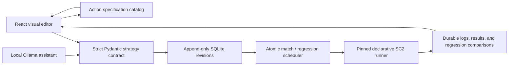

# SC2 Bot Studio

SC2 Bot Studio is a local, desktop-first web application for creating, editing, forking, and testing StarCraft II bots without writing Python. Bot behavior is stored as a validated strategy document made of phases, triggers, and safe burnySC2 actions.

The repository includes eight editable built-in strategies:

- `terran-basic`
- `terran-bunker-rush`
- `protoss-basic`
- `protoss-intermediate`
- `protoss-tower-rush`
- `zerg-basic-1`
- `zerg-basic-2`
- `ryan-zealot-rush` (the migrated legacy one-base four-Gateway all-in)

All supported bots—including Ryan Zealot Rush—run exclusively through the
validated declarative strategy engine. The checked-in fixtures in
`strategies/builtin_bots.json` are the source of truth for built-in behavior.

## Features

- Searchable bot library with race filters and built-in/custom labels
- Blank, fork-based, and Ollama-assisted bot creation
- Drag-reorderable phases and rule cards
- Catalog-driven visual trigger and action editors with race-correct defaults
- Validated plaintext modifications with preview, assumptions, warnings, apply, and reject
- Strict semantic strategy validation with bounded document complexity
- Immutable, digest-verified revision history with restoration
- Recoverable Trash
- Dynamic discovery of locally installed SC2 maps
- One atomic local scheduler for single matches and regression batches
- Cursor-safe bounded live logs, disconnect recovery, and partial-failure reporting
- Persistent win/loss, opponent, revision, map, and in-game duration history
- Studio bot versus Studio bot matches
- Automatic acceptance of unambiguous surrender messages from SC2 computer opponents
- Expansion-aware army scouting after known enemy targets are destroyed
- Configurable inactivity detection that records stalled games as ties
- Revision-pinned benchmark suites and manual regression comparisons
- Optional two-match parallelism for regression batches
- Scouting, defense, wounded-unit retreat, and race-specific upgrade research
- Transactional SQLite migrations with automatic pre-migration backups
- CLI compatibility for every database-backed bot

## Prerequisites

- macOS with StarCraft II installed
- Python 3.10+
- Node.js 24 LTS (automatically detected from Codex when run inside the app)
- Ollama only if you want plaintext creation/modification

The visual editor and match runner work when Ollama is not installed.

## Setup

```bash
make setup
```

You do not need `nvm` to run the project. The setup command checks for a
compatible Node runtime and uses the Node 24 runtime bundled with Codex when
available. Outside Codex, install Node.js 24 LTS (using `nvm` is optional).
Run `make doctor` to see which runtime will be used.

For the plaintext assistant, install Ollama separately and download the default local model:

```bash
ollama pull qwen3:8b
```

Optional settings can be copied from `.env.example` into `.env` or exported in your shell. The defaults use `http://127.0.0.1:11434` and `qwen3:8b`.

## Development

Run the FastAPI backend and Vite frontend together:

```bash
make dev
```

Open [http://127.0.0.1:5173](http://127.0.0.1:5173).

The API is available at [http://127.0.0.1:8000/api/health](http://127.0.0.1:8000/api/health), and interactive API documentation is available at `/docs`.

## Architecture

The visual editor, assistant, runtime, and persistence layer share one strategy
contract. The public catalog describes each action's valid fields, entity roles,
supported races, and safe defaults; the API validates the resulting strategy
again before any revision is saved.



## Production-style local run

Build the frontend and serve it from the local FastAPI process:

```bash
make run
```

Open [http://127.0.0.1:8000](http://127.0.0.1:8000).

Both modes bind only to the loopback interface.

## CLI

List all active bots:

```bash
.venv/bin/python run_bot.py --list-bots
```

Run a built-in or user-created strategy by slug or UUID:

```bash
.venv/bin/python run_bot.py \
  --bot protoss-intermediate \
  --map AcropolisLE \
  --enemy-race terran \
  --difficulty medium_hard
```

Run two Studio bots against each other:

```bash
.venv/bin/python run_bot.py \
  --bot protoss-intermediate \
  --opponent-bot zerg-basic-2 \
  --map AcropolisLE
```

The CLI and web application read the same SQLite database at `data/studio.db`. Override it with `SC2_STUDIO_DB` or `--database`.

Every declarative CLI and web match is recorded in SQLite. Win rate uses
decisive games only; ties, stopped matches, and technical failures are shown
separately.

## Regression testing

Open a bot's **Stats** screen to create reusable benchmark suites and compare
its current revision with an older revision. Studio bots used as benchmarks are
pinned to an exact revision. Candidate and baseline games use matching maps,
settings, and random seeds.

Regression games run one at a time by default. Selecting two parallel games can
substantially increase resource usage: a computer match launches one SC2
process, while a Studio bot versus Studio bot match launches two.

Single-match and regression admission uses the same scheduler lock, so the two
workflows cannot race into overlapping launches. Regression batches that finish
with one or more technical failures are recorded as `completed_with_failures`
instead of being presented as clean successes. If an event stream disconnects,
the UI polls the persisted run state while reconnecting from its last absolute
log sequence. Retained output is bounded in both SQLite and the browser.

## Strategy model

A strategy contains ordered phases. Each phase has an activation condition and ordered rules. Rules have:

- a composable `always`, `all`, `any`, `not`, or metric trigger;
- a priority and `continuous`, `once`, or `cooldown` execution policy;
- one or more actions from the registered safe action catalog.

Supported actions cover worker distribution, worker/supply/gas targets,
construction, unit production with fallbacks, expansion, forward construction,
army attacks, emergency worker attacks, scouting, defense, wounded-unit
retreat, and race-specific upgrade research. The runtime reports whether an
action is satisfied, made progress, or is blocked, so a one-shot rule is not
marked complete merely because it issued an unfinished command. It never
evaluates source code from the database or from a model.

Every assistant response is constrained to the same Pydantic JSON schema used by the visual editor and runtime. A proposal must validate and be explicitly applied before it creates a revision.

## Data integrity and migrations

Database initialization applies an ordered migration ledger and records the
matching SQLite `user_version`. Before upgrading an existing application
schema, Bot Studio creates and verifies a timestamped SQLite backup in a
`backups/` directory beside the configured database. Fresh empty databases do
not create unnecessary backups.

Every strategy revision stores a canonical SHA-256 content digest. SQLite
triggers make revision rows append-only and enforce consistent revision
identity, number, and digest references for:

- the current bot revision and managed built-in revision;
- match participants;
- benchmark opponents;
- regression candidates, baselines, opponents, and games;
- assistant proposals.

Changing a checked-in built-in strategy appends one managed revision instead of
rewriting history. Editing that built-in through the application transfers it
to user control, so later fixture synchronization will not overwrite the edit.
Migration backfills fail closed if a legacy integer revision reference cannot
be resolved unambiguously.

Match output is stored with an absolute per-match sequence. This keeps launch
and runtime diagnostics available after a backend restart while allowing old
lines to be pruned without making a reconnect cursor ambiguous.

To inspect a backup without replacing the working database, keep the app
stopped, copy the backup to a temporary path, and point `SC2_STUDIO_DB` at the
copy. Starting Bot Studio against that copy will migrate the copy if necessary.

## Tests

```bash
make test
```

Backend tests validate all eight built-in strategies, strict action contracts,
race and entity-role safety, action outcomes, migrations, immutable provenance,
match telemetry, concurrent migration startup, launch/process cancellation,
atomic regression scheduling, durable log cursor retention, forks, Trash, and
API operations. Frontend tests cover catalog-driven action editing, bot-v-bot
setup, sequence-aware stream recovery, bounded log retention, benchmark
configuration, provenance, and partial regression failures.

## Local data

SQLite data and backups under the default `data/` directory, generated frontend
files, virtual environments, and logs are ignored by Git. Deleting a bot in the
UI only moves it to Trash. Built-in fixtures live in
`strategies/builtin_bots.json` and synchronize idempotently through append-only
revisions.
